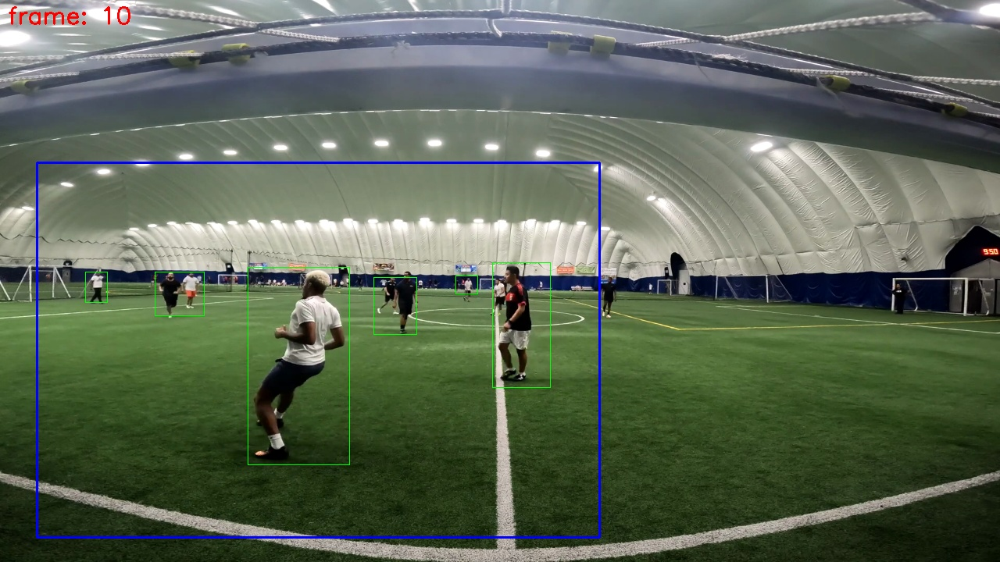

# Sports Motion Detection and Viewport Detection
## Dependencies installation
In your virtual environment, install all the dependencies
1. `pip install pip-tools`
2. `pip-compile --upgrade requirements.in`
3. `pip install -r requirements.txt`

## Testing 
Run the `pipeline.py`
- `python pipeline.py --video data/sample_video_clip.mp4`

Running the pipeline.py generates the following files and directories in the `output` directory. Here, `frame` and `viewport` directory contains annotated frames with motion detection and viewport tracking. 

As reference, frame and viewport images respectively

## Approach
1. Video Processing: Extract frames at 5ps from video and resize
2. Motion Detection: 
    - Blurring with Gaussian Filter
    - For each frame, compute difference with this frame and prior frame
    - Threshold the absolute difference
    - Dilate frames to fill-in holes
    - Find countours in the dilated image
    - Filter the countour areas and thereby detect motions
3. ViewPort tracking
    - Tracks the viewport center across frames on detected motions 
    - Uses Kalman Filtering to track 2D positions 
    - Multiple Kalman filters per object to keep track of them

## Challenges I encountered:
1. Motion Detection
    - Tuning kernel size, dilation iterations, thresholding constants, and area threshold of hyper parameteres
2. View Port Detection
    -  Tuning parameters for kalman filters
